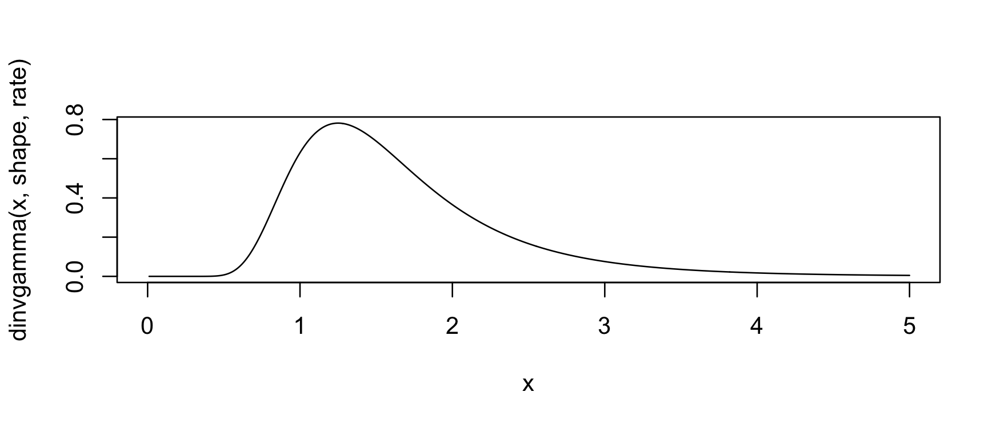
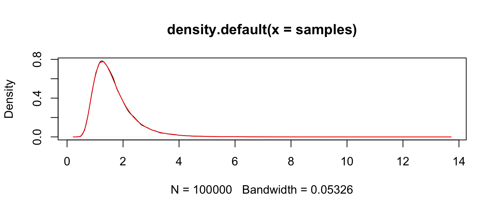
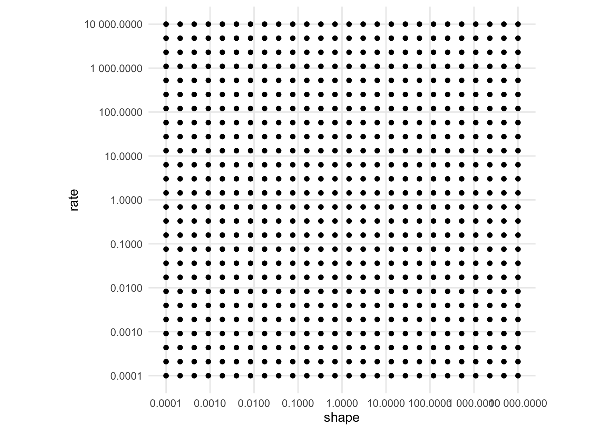
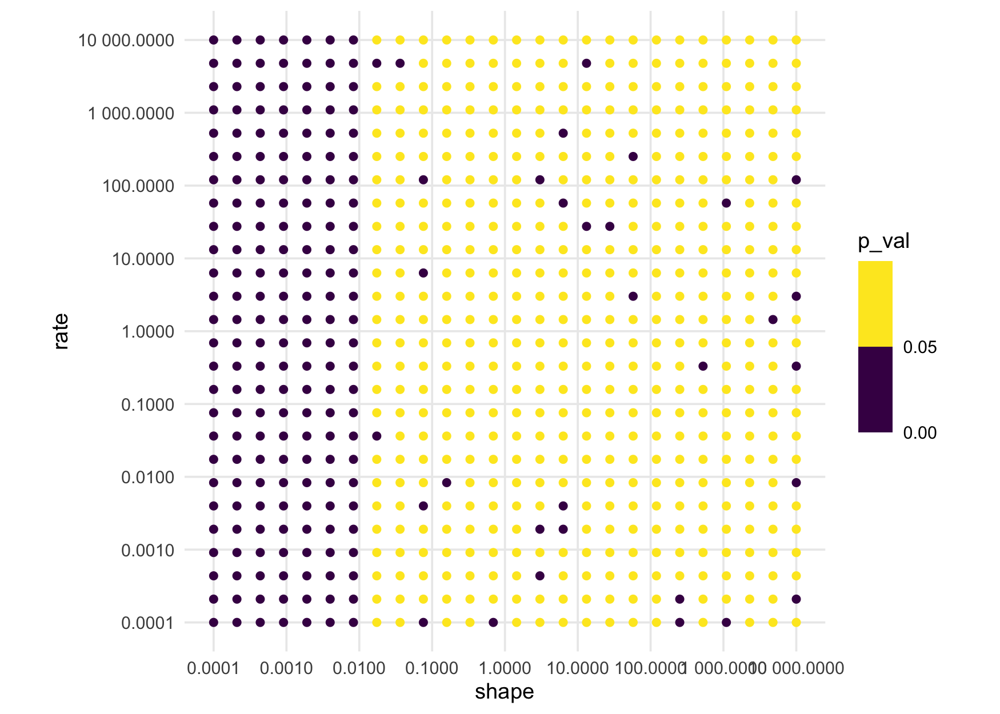
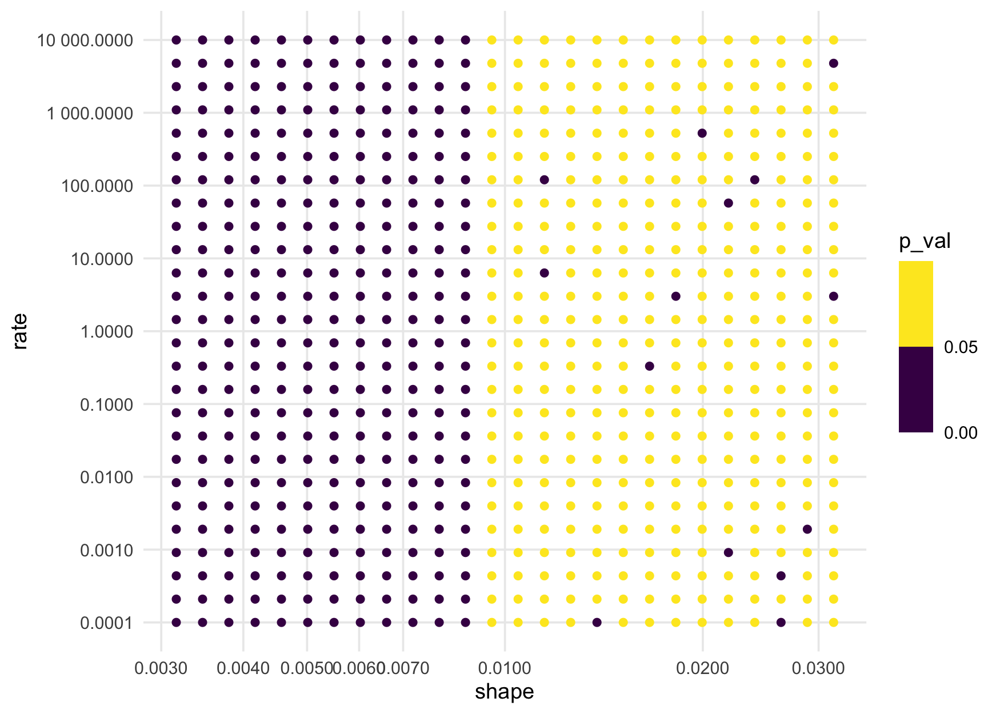
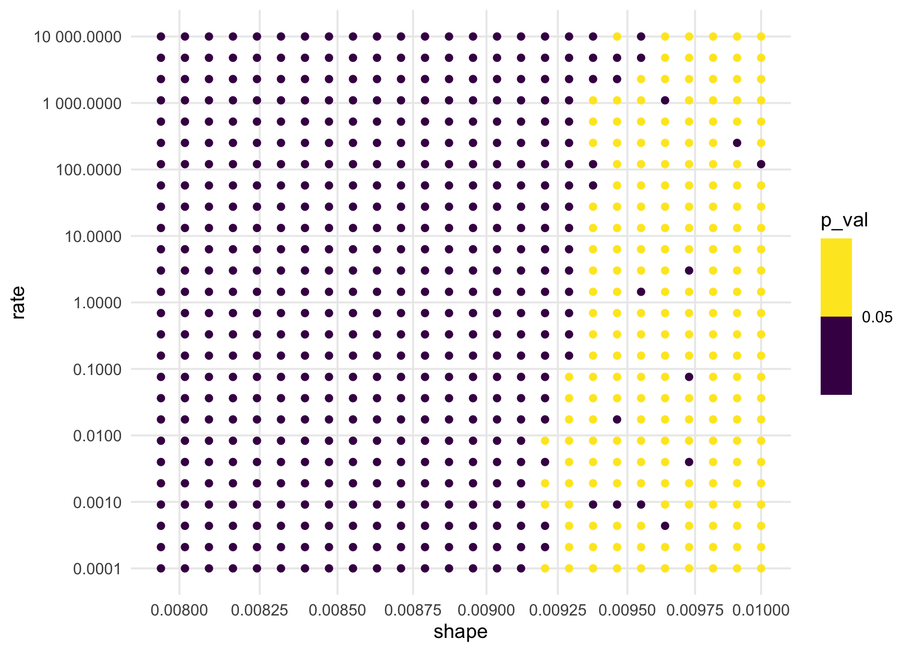

<!-- README.md is generated from README.Rmd. Please edit that file -->

# **invgamma**

**invgamma** implements the `(d/p/q/r)` statistics functions for the
[inverse gamma
distribution](https://en.wikipedia.org/wiki/Inverse-gamma_distribution)
in [R](http://cran.r-project.org). It is ideal for using in other
packages since it is lightweight and leverages the `(d/p/q/r)gamma()`
line of functions maintained by CRAN.

*Please see the section on parameterizations below to avoid any
unintended mistakes!*

### Getting **invgamma**

There are two ways to get **invgamma**. For the [CRAN
version](https://cran.r-project.org/package=invgamma), use

``` r
install.packages("invgamma")
```

For the development version, use

``` r
# install.packages("devtools")
devtools::install_github("dkahle/invgamma")
```

### The `(d/p/q/r)invgamma()` functions

The functions in **invgamma** match those for the gamma distribution
provided by the **stats** package. Namely, it uses as its density *f(x)
= (b^a / Gamma(a)) x^-(a+1) e^(-b/x),* where a = `shape` and b = `rate`.

The [PDF](https://en.wikipedia.org/wiki/Probability_density_function)
(the *f(x)* above) can be evaluated with the `dinvgamma()` function:

``` r
library("invgamma")
x <- seq(0, 5, .01)
shape <- 7; rate <- 10
plot(x, dinvgamma(x, shape, rate), type = "l")
```



The
[CDF](https://en.wikipedia.org/wiki/Cumulative_distribution_function)
can be evaluated with the `pinvgamma()` function:

``` r
f <- function(x) dinvgamma(x, shape, rate)
q <- 2
integrate(f, 0, q)
#  0.7621835 with absolute error < 7.3e-05
(p <- pinvgamma(q, shape, rate))
#  [1] 0.7621835
```

The [quantile function](https://en.wikipedia.org/wiki/Quantile_function)
can be evaluated with `qinvgamma()`:

``` r
qinvgamma(p, shape, rate) # = q
#  [1] 2
```

And random number generation can be performed with `rinvgamma()`:

``` r
set.seed(1234)
rinvgamma(5, shape, rate)
#  [1] 2.640734 1.364965 1.342591 2.095975 1.273201
```

`rinvgamma()` can be used to obtain a [Monte
Carlo](https://en.wikipedia.org/wiki/Monte_Carlo_method) estimate of the
probability given by `pinvgamma()` above:

``` r
samples <- rinvgamma(1e5, shape, rate)
mean(samples <= q)
#  [1] 0.76401
```

Moreover, we can check the consistency and correctness of the
implementation with

``` r
plot(density(samples))
curve(f(x), col = "red", add = TRUE)
```

 Or

``` r
ks.test(
  samples, 
  function(p) pinvgamma(p, shape, rate)
)
#  
#   Asymptotic one-sample Kolmogorov-Smirnov test
#  
#  data:  samples
#  D = 0.0029822, p-value = 0.3361
#  alternative hypothesis: two-sided
```

### The `(d/p/q/r)invchisq()` and `(d/p/q/r)invexp()` functions

The [gamma
distribution](https://en.wikipedia.org/wiki/Gamma_distribution) subsumes
the
[chi-squared](https://en.wikipedia.org/wiki/Chi-squared_distribution)
and
[exponential](https://en.wikipedia.org/wiki/Exponential_distribution)
[distributions](https://en.wikipedia.org/wiki/Probability_distribution#Continuous_probability_distribution),
so it makes sense to include the `*invchisq()` and `*invexp()` functions
in **invgamma**. Their implementations, however, wrap `*chisq()` and
`*exp()`, not `*invgamma()`.

### A note on parameterizations

As detailed [here](https://github.com/dkahle/invgamma/issues/1), the
parameterizations of the functions in this package cue off of their
corresponding non-inverse distributions from **stats**. This commonly
causes the confusion that, for example, the parameter `rate` in
`dinvgamma()` is the rate parameter of the inverse gamma distribution.
It is not! It is the rate parameter of the corresponding gamma
distribution. Please take care with this distinction.

### A note on numerics

**invgamma** was intended to be a lightweight and simple, largely
self-maintaining package implementing the inverse gamma, inverse
chi-square, and inverse exponential distributions. It uses [the
transformation
theorem](https://en.wikipedia.org/wiki/Random_variable#Functions_of_random_variables)
in all cases.

One of the challenges to using naive implementations of distributions is
that their
[numerics](https://en.wikipedia.org/wiki/Floating-point_arithmetic) may
not work well. Arithmetic on a computer is not the same as arithmetic in
theory, the kind that you meet in math classes, and as a consequence the
best computer implementations of mathematical facts/algorithms need to
be tailored to the specific cases at hand.

In January 2023 I did a little poking around into this for `rinvgamma()`
and found that it performs poorly when the shape parameter is less than
.001 or so. The resulting distributions are very heavy-tailed, and the
draws from these distributions returned by `rinvgamma()` are so large
that they get rounded to either very large numbers (where the floating
point representation of numbers does not provide many numbers) or
infinity. Example:

``` r
rinvgamma(10, shape = 3, rate = 7)
#   [1] 3.252524 4.540151 2.352486 3.012428 1.679808 2.265310 4.428625 1.836283
#   [9] 2.276005 1.746593
```

#### KS tests for sampling accuracy

Here is a more detailed Monte Carlo investigation that checks sampler
quality using [the Kolmogorov-Smirnov
test](https://en.wikipedia.org/wiki/Kolmogorov–Smirnov_test).

First, we write a basic Monte Carlo test for the sampler that works by
generating a large (`n = 1e6`) sample of draws from the inverse gamma
distribution for a given shape and rate:

``` r
test_for_shape_rate <- function(shape, rate, n = 1e6) {
  samples <- rinvgamma(1e6, shape, rate)
  ks.test(samples, function(p) pinvgamma(p, shape, rate))$p.value
}

test_for_shape_rate(3, 7)
#  [1] 0.4950153
```

The function returns the *p*-value associated with the KS test, so
“small” values suggest a departure from the null hypothesis that the
distribution is from the corresponding inverse gamma distribution: the
sampler is performing poorly. Under the null hypothesis, [the *p*-value
has an approximate uniform
distribution](https://en.wikipedia.org/wiki/P-value#p-value_as_the_statistic_for_performing_significance_tests),
a fact that can be found in most advanced mathematical statistics books,
so we would expect some proportion to be small regardless.

We want to see the behavior of the sampler `rinvgamma()` across a wide
array of parameter values. To do this, we use a range of parameter
values running from small (10<sup>−</sup>4) to large (10<sup>3</sup>):

``` r
library("tidyverse"); library("scales")
theme_set(theme_minimal())
theme_update(panel.grid.minor = element_blank())

N <- 26
param_vals <- 10^seq(-4, 4, length.out = N)
(param_grid <- expand_grid(shape = param_vals, rate = param_vals))
#  # A tibble: 676 × 2
#      shape     rate
#      <dbl>    <dbl>
#   1 0.0001 0.0001  
#   2 0.0001 0.000209
#   3 0.0001 0.000437
#   4 0.0001 0.000912
#   5 0.0001 0.00191 
#   6 0.0001 0.00398 
#   7 0.0001 0.00832 
#   8 0.0001 0.0174  
#   9 0.0001 0.0363  
#  10 0.0001 0.0759  
#  # … with 666 more rows
```

Here’s what the experiment’s design space looks like:

``` r
ggplot(param_grid, aes(shape, rate)) +
  geom_point() +
  scale_x_log10(n.breaks = 10, labels = label_number()) +
  scale_y_log10(n.breaks = 10, labels = label_number()) +
  coord_equal()
```



Now, we run our test for each point in the design space in parallel.
(Note: we’ve suppressed warnings here that are relevant.)

``` r
library("furrr")
#  Loading required package: future
plan(multisession(workers = parallelly::availableCores()))

param_grid <- param_grid %>% 
  mutate(p_val = future_map2_dbl(
    shape, 
    rate, 
    test_for_shape_rate, 
    .options = furrr_options(seed = TRUE)
  ))

plan(sequential)
```

And we visualize the distribution of the *p*-values over that space,
binning the colors to at .05 to highlight the rejections of the tests at
the 5% level:

``` r
ggplot(param_grid, aes(shape, rate, color = p_val)) +
  geom_point() +
  scale_x_log10(n.breaks = 10, labels = label_number()) +
  scale_y_log10(n.breaks = 10, labels = label_number()) +
  scale_color_viridis_b(breaks = c(0, .05, 1)) +
  coord_equal()
```



If the sampler were working correctly, the *p*-values would be
approximately IID uniform(0,1), so we would expect about 5% of the
points to be purple, and those 5% would be uniformly distributed over
the whole space with no patterns. Obviously, that’s not the case: when
the shape parameter is small, the test is always rejecting. Clearly,
when `shape` is small, the sampler does not work well.

The cutoff seems to be right around `shape = .01`, so let’s rerun the
simulation zooming in on that boundary.

``` r
# reset the grid
param_vals_small <- 10^seq(-2.5, -1.5, length.out = N)
param_grid <- expand_grid(shape = param_vals_small, rate = param_vals)


# rerun the simulation
plan(multisession(workers = parallelly::availableCores()))
param_grid <- param_grid %>% 
  mutate(
    p_val = future_map2_dbl(shape, rate, test_for_shape_rate, .options = furrr_options(seed = TRUE))
  )
plan(sequential)


# plot results
ggplot(param_grid, aes(shape, rate, color = p_val)) +
  geom_point() +
  scale_x_log10(n.breaks = 10, labels = label_number()) +
  scale_y_log10(n.breaks = 10, labels = label_number()) +
  scale_color_viridis_b(breaks = c(0, .05, 1))
```



The cutoff appears to be a little below `0.01`, but I include this in
the warning in `rinvgamma()` as a good rule of thumb. Let’s zoom in a
bit more…

``` r
# reset the grid
param_vals_small <- 10^seq(-2.1, -2, length.out = N)
param_grid <- expand_grid(shape = param_vals_small, rate = param_vals)


# rerun the simulation
plan(multisession(workers = parallelly::availableCores()))
param_grid <- param_grid %>% 
  mutate(
    p_val = future_map2_dbl(shape, rate, test_for_shape_rate, .options = furrr_options(seed = TRUE))
  )
plan(sequential)


# plot results
ggplot(param_grid, aes(shape, rate, color = p_val)) +
  geom_point() +
  scale_x_log10(n.breaks = 10, labels = label_number()) +
  scale_y_log10(n.breaks = 10, labels = label_number()) +
  scale_color_viridis_b(breaks = c(0, .05, 1))
```



The simulation confirms that over a reasonably large range of the
parameters the quality of the sampler depends almost entirely on `shape`
(though there is roughly a linear dependence on `shape` and `rate`). As
an easy rule, the sampler can be considered unreliable for `shape`
values less than `0.01`.
