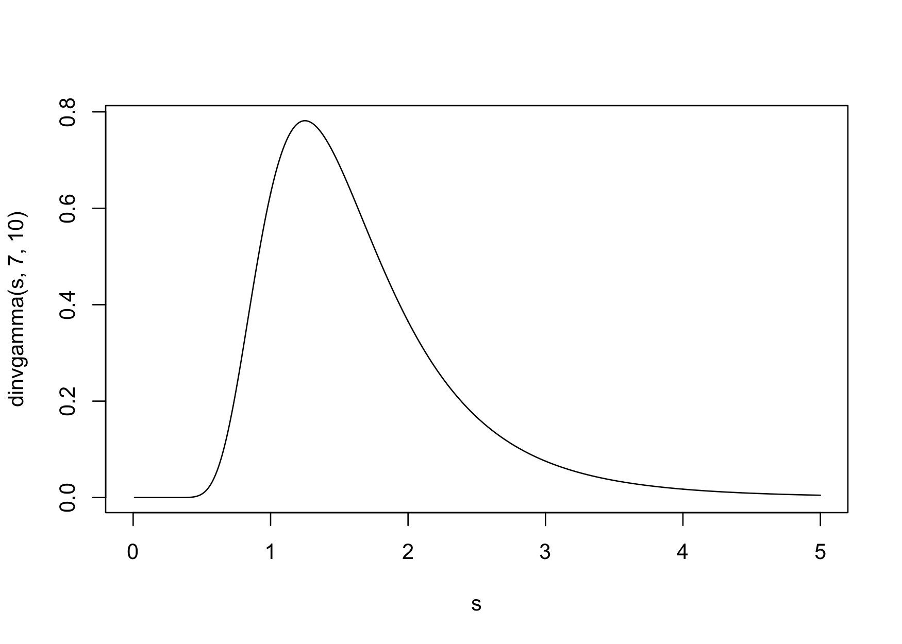

<!-- README.md is generated from README.Rmd. Please edit that file -->
**invgamma**
============

The functions in **invgamma** match those for the gamma distribution provided by the **stats** package. Namely, it uses as its density *f(x) = (b^a / Gamma(a)) x^-(a+1) e^(-b/x),* where a = `shape` and b = `rate`.

``` r
library(invgamma)
s <- seq(0, 5, .01)
plot(s, dinvgamma(s, 7, 10), type = 'l')
```



``` r
f <- function(x) dinvgamma(x, 7, 10)
q <- 2
integrate(f, 0, q)
#> 0.7621835 with absolute error < 7.3e-05
(p <- pinvgamma(q, 7, 10))
#> [1] 0.7621835
qinvgamma(p, 7, 10) # = q
#> [1] 2
mean(rinvgamma(1e5, 7, 10) <= 2)
#> [1] 0.76398
```

Installation
------------

To install from [CRAN](https://cran.r-project.org):

``` r
install.packages("invgamma")
```

To install the developmental version:

``` r
install.packages("devtools")
devtools::install_github("dkahle/invgamma")
```
